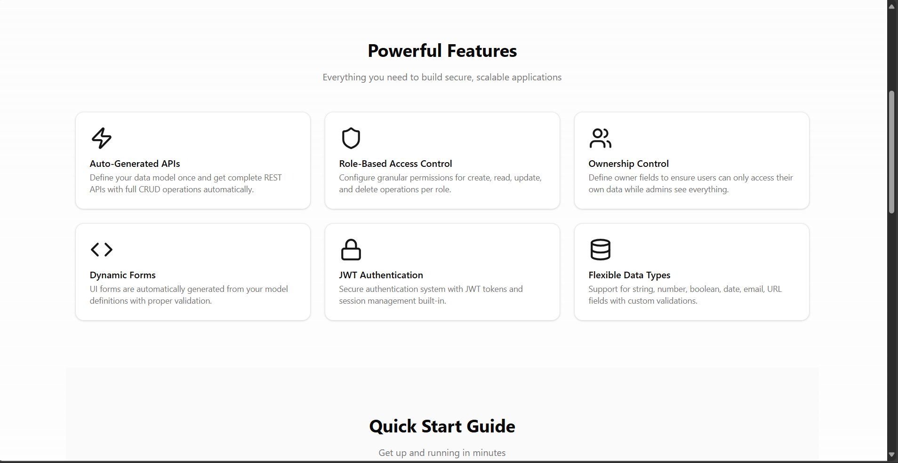
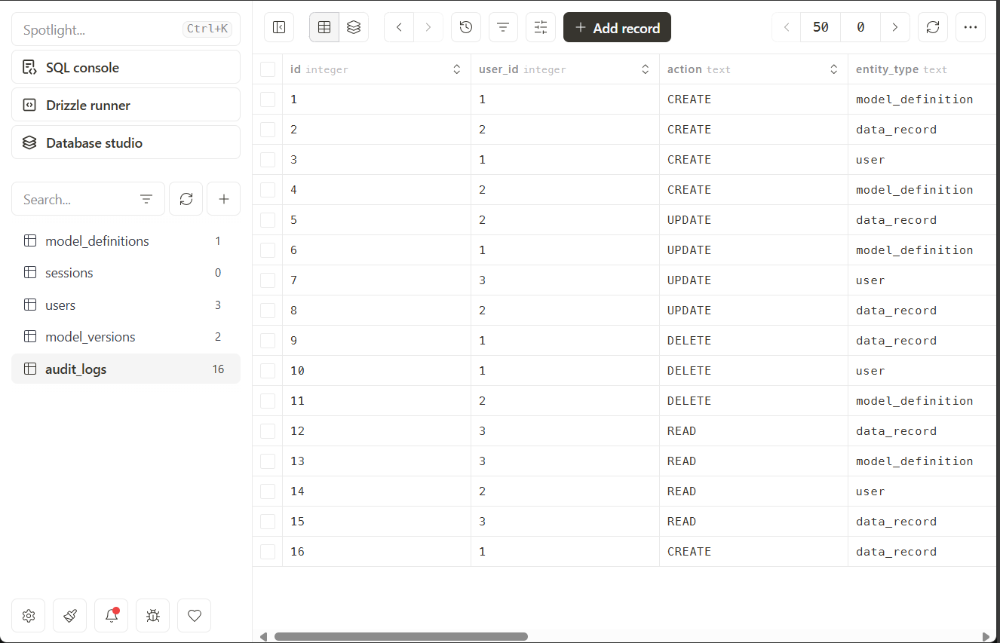

# Low-Code CRUD Platform with RBAC


_Welcome to our Low-Code CRUD Platform_

A powerful low-code platform that enables rapid application development through dynamic model definitions and automated CRUD API generation with built-in Role-Based Access Control (RBAC).


## 🎯 Platform Overview


_System Architecture Overview_


_Technology Stack Used in the Platform_


_Key Features of the Platform_

## 🌟 Features

- **Dynamic Model Definition**: Create data models through an intuitive UI
- **Automated CRUD**: Instant API endpoints for your models
- **Role-Based Access Control**: Fine-grained permissions at model and field level
- **Modern Admin UI**: Built with shadcn/ui and Tailwind CSS
- **Type Safety**: Full TypeScript support throughout the stack
- **Real-time Updates**: Live preview as you define models
- **Audit Logging**: Track all data changes
- **Version Control**: Model versioning support
- **Database Migrations**: Automatic schema updates

## 📊 System Components


_User Journey and Workflow_


_Database Schema and Structure_


_Database Users and Access Control_

### User Journey


### Database Schema


### Database Users and Permissions


## 🚀 Quick Start

### Prerequisites

- Node.js 18.17 or later
- npm or pnpm package manager
- Git

### Installation

1. Clone the repository:

   ```bash
   git clone https://github.com/yourusername/low-code-crud-platform.git
   cd low-code-crud-platform
   ```

2. Install dependencies:

   ```bash
   npm install
   # or
   pnpm install
   ```

3. Set up environment variables:

   ```bash
   cp .env.example .env.local
   ```

   Update the variables in `.env.local` with your configuration.

4. Run database migrations:

   ```bash
   npm run db:migrate
   # or
   pnpm db:migrate
   ```

5. Start the development server:
   ```bash
   npm run dev
   # or
   pnpm dev
   ```

Visit [http://localhost:3000](http://localhost:3000) to access the platform.

## 📖 Usage Guide

### Model Definition and CRUD Generation


_Create and manage your data models through an intuitive interface_


_Automatic CRUD API generation based on your model definitions_

### Creating a New Model

1. Navigate to the Admin Dashboard at `/admin/models`
2. Click "Create New Model"
3. Define your model schema:
   ```typescript
   {
     "name": "Product",
     "fields": [
       {
         "name": "title",
         "type": "string",
         "required": true
       },
       {
         "name": "price",
         "type": "number",
         "required": true
       }
     ],
     "permissions": {
       "create": ["admin", "manager"],
       "read": ["admin", "manager", "user"],
       "update": ["admin", "manager"],
       "delete": ["admin"]
     }
   }
   ```
4. Click "Save" to publish your model

### How Dynamic CRUD Works

The platform automatically generates:

1. **Database Tables**: Using Drizzle ORM for schema creation
2. **API Routes**: Dynamic endpoints at `/api/data/[modelName]`
3. **Type Definitions**: TypeScript interfaces for type safety
4. **Admin UI**: Auto-generated forms and tables
5. **Documentation**: OpenAPI specs for your endpoints

Example generated endpoints for a "Product" model:

```plaintext
GET    /api/data/product        # List all products
POST   /api/data/product        # Create a product
GET    /api/data/product/:id    # Get single product
PUT    /api/data/product/:id    # Update a product
DELETE /api/data/product/:id    # Delete a product
```

### File-Write Implementation

The platform handles file operations through:

1. **Model Definition Storage**:
   - Models are stored in SQLite via Turso
   - Changes trigger automatic migrations

2. **File Upload Support**:
   - Built-in handling for file/image fields
   - Automatic resize and optimization
   - Secure storage with proper access control

3. **Version Control**:
   - All model changes are versioned
   - Roll back capability for schemas
   - Migration history tracking

## 🛠️ Architecture

```plaintext
┌─────────────────┐
│   Admin UI      │
│  Next.js Pages  │
└────────┬────────┘
         │
┌────────▼────────┐
│   API Layer     │
│  CRUD + RBAC    │
└────────┬────────┘
         │
┌────────▼────────┐
│  Data Layer     │
│  Turso + Drizzle│
└─────────────────┘
```

## 🔒 Security

- JWT-based authentication
- Role-based access control
- Field-level permissions
- SQL injection prevention
- XSS protection
- CSRF tokens
- Rate limiting

## 🧪 Testing

Run the test suite:

```bash
npm run test
# or
pnpm test
```

Coverage report:

```bash
npm run test:coverage
```

## 📚 API Documentation

Detailed API documentation is available at:

- [API Documentation](./API-DOCUMENTATION.md)
- [Architecture Overview](./ARCHITECTURE.md)

## 🤝 Contributing

1. Fork the repository
2. Create your feature branch: `git checkout -b feature/amazing-feature`
3. Commit your changes: `git commit -m 'Add amazing feature'`
4. Push to the branch: `git push origin feature/amazing-feature`
5. Open a Pull Request

## 📝 License

This project is licensed under the MIT License - see the [LICENSE](LICENSE) file for details.

## 🙋‍♂️ About the Developer

This project was developed as part of a technical assessment for a Senior Full Stack Developer position. It demonstrates expertise in:

- Modern web architecture
- TypeScript and Next.js
- Database design and ORM usage
- Security best practices
- API design and documentation
- Testing and quality assurance

## 🎯 Assessment Requirements Met

✅ Dynamic Model Definition  
✅ Automated CRUD Generation  
✅ Role-Based Access Control  
✅ Clean Architecture  
✅ Comprehensive Testing  
✅ Professional Documentation  
✅ Bonus Features Implemented

---

Built with ❤️ by Avinash
